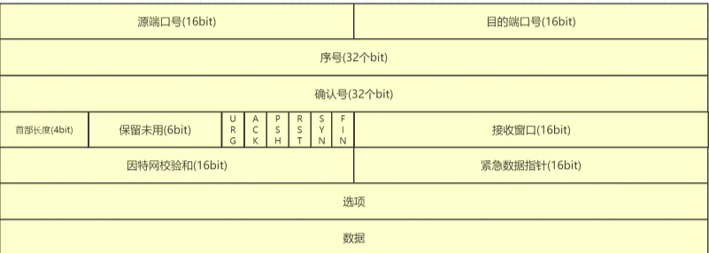
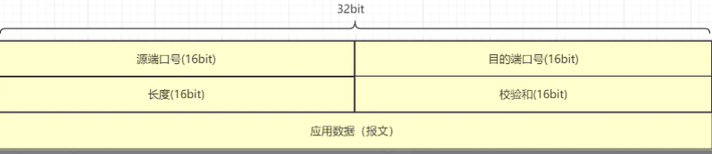
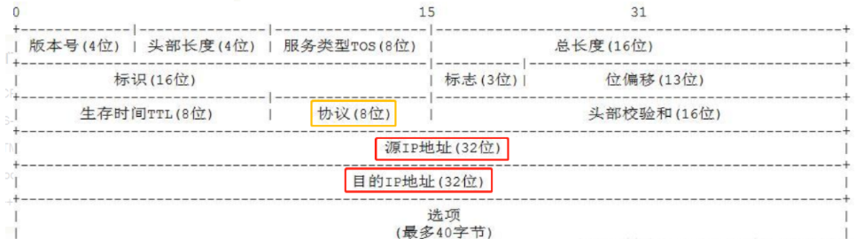
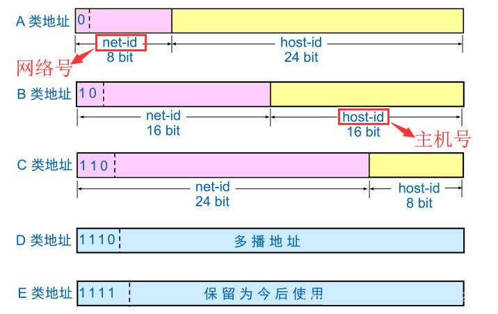

http超文本传输协议,web是建立在HTTP协议上面通信的


### HTTP

90年问世的HTTP版本并不多,我们常说的HTTP实际上是指的HTTP1.1,它从97年公布开始直到今天也还在被广泛的使用,与96年的1.0相比1.1多了长链接功能.1.0之前的版本统称为0.9.

#### TCP/IP协议族

TCP/IP是对互联网相关的各类协议的总称,像我们熟悉的PPPoE(点对点拨号),FTP(文件传输),IEEE802.11(WLAN),DNS(域名解析),TCP,UDP,IP,ICMP等

TCP/IP协议簇分为五层,OSI分为七层,也有把物理层和数据链路层合为一层(网路接口层)的说法


+ 应用层  为应用进程提供服务,数据的加密压缩建立会话,包含FTP,DNS,HTTP     HTTP数据

+ 传输层  两台计算机之间的数据传输,定义协议端口号流控差错校验(**端到端**),包含TCP,UDP   TCP首部+HTTP数据

  

  

+ 网络层   用于处理网络上流动的数据包,进行逻辑寻址,确定传输路线,IP     IP首部+TCP首部+HTTP数据

  

+ 数据链路层  处于用于链接网路的硬件部分(网卡),MAC地址寻址 以太网首部+IP首部+TCP首部+HTTP数据

  在相邻的两个节点之间通信,会进行数据分帧并进行帧编码,需要通过检错,纠错进行重发

| 目的MAC地址 | 原MAC地址48 | 协议类型 |
| ----------- | ----------- | -------- |
| 48位        | 48位        | 16位     |


+ 物理层  建立维护物理连接

发送端从应用层向下走不断的封装添加每一层的首部,传输层会对HTTP数据分隔,标号并添加端口号IP层封装得到IP数据包是数据传输的最小单位,增加MAC地址.

服务端接受到数据之后不断的向上层传递,拆包最后组装成数据给到应用层


传输中涉及三个地址  域名,IP地址,MAC地址.  通过DNS服务将域名转换为IP地址通过ARP协议将IP地址转为MAC地址.MAC地址作为硬件地址是唯一且不可变的.有MAC地址就能找到电脑,IP地址能够找到网段. 这两个地址就能连接通信的两台计算机. 而连接计算机还是不够的还要连接不同的应用,每个应用都有自己的端口.通过端口连接应用,然后就是应用所在的应用层了.

##### IP协议与IP地址

IP网路协议位于网络层,作用是把数据包发送给对方,受MTU(最大传输单元,一条链路上的最小值)的影响需要进行分片.关于路由选择,路由器查表是否有IP记录如果没有则丢弃包并返回消息目标不可达.注意IP协议是无连接不可靠的

IP地址分为A,B,C,D,E五类



​	

其中主机号全为0的为网络地址,全为1的为广播地址,可以在主机号的基础上进行子网的划分

通过子网掩码与IP地址进行与操作得出网络号,相同的网络号可以直接通信,不同的网络号要通过网关通信,网关处于多个网路中.

##### TCP

mss限制TCP包的大小就会拆成多个TCP报文;粘包多条数据打包成一个TCP报文.

TCP位于传输层提供可靠的字节流服务.为了保证数据能够到达目标需要通过三次握手建立连接,四次挥手解除连接

TCP发送数据有发送缓冲区和接收缓冲区,并由接收方确定发送窗口,通过Ack进行累计确认

SYN(建立连接), ACK(确认) ,PSH(标志数据尾,把缓存区中的数据返回给进程), FIN(关闭连接), RST(连接重置), URG(紧急位偏移不进缓冲区),  Sequence number(序号号码), Acknowledge number(确认号码)

序列号是一个与时间相关的随机数,增加到最大后会重置

三次握手

+ 第一次

  客户端发送SYN=1,以及随机的seq number给服务端

+ 第二次

  服务端接收到请求后发送确认 ack(发送端的seq+1),SYN,ACK,随机seq number

+ 第三次

  客户端接收到后检查数据,若正确则发送 ack number(服务端seq+1)   ack=1,这一次可以传递数据

四次挥手

+ 第一次

  主动关闭方发送FIN和seq number m,表明自己不会发送数据了

+ 第二次

  被动方收到FIN后发送acknumber m+1,seq ACK=1确认收到

+ 第三次

  被动方发送FIN,ACK=1,seq=w,ack=m+1表明自己不会发数据了

+ 第四次

+ 主动方发送ACK=1,seq=u+1,ack=w+1 确认收到

  三次握手而要四次挥手,因为关闭连接需要准备,FIN和ACK分开发送,而建立连接不需要准备,ACK与SYN一同发送

TCP还有超时重传,快速重传,滑动窗口,慢启动,拥塞避免,拥塞发生,快速恢复等知识点

#### HTTP

​	HTTP请求:请求行(方法,URI,协议版本以空格分隔),消息报头(每种一行),请求正文

​	HTTP响应:状态行(协议版本,状态码,状态码描述),消息报头,响应正文

​	报文头部包含 请求头部(响应头部) 通用头部 实体头部

​	报文 = 报文头部+报文主体  实体 = 实体头部+实体主体(有效载荷)

​	每个首部字段与下一个以回车换行符分隔,头部与实体之间又加了回车换行符

​	RESTful规范   **URL定位资源，用HTTP动词（GET,POST,DELETE,PUT）描述操作**

##### 请求行的方法 

+ GET 获取资源
+ POST 新增资源
+ DELETE 删除资源
+ PUT 更新资源
+ HEAD 不请求资源返回头部
+ OPTIONS 确定服务器性能,支持的方法
+ TRACE 追踪路径用于诊断类似于ping
+ CONNECT 代理服务器

##### 状态行中的状态码

+ 1xx  请求已经接收,需要继续发送请求(协议协商,切换协议)
+ 2xx  成功 
+ 3xx  重定向 301资源永久移动,302资源暂时移动,304(本地重定向,缓存),305资源需代理,307临时重定向(原资源不能访问) 
+ 4xx  客户端错误 400请求语法错误,402需要验证,403请求方法不对,404没找到
+ 5xx  服务端错误

##### 请求头

+ 请求
  + Accept 用户代理处理的媒体类型MIME
  + Accept-Charset:"字符集",Accept-Encoding:字符编码(gzip),Accept-language:语言
  + Authorization: Web认证信息
  + Host: 资源所在的服务器 代理服务器使用
  + Referer: 请求的获取方,在哪个网站发起的请求,比如CSDN https://www.cnblogs.com/
  + if-Match, if-None-Match
  + if-Modified-Since,if-Unmodified-Since
  + User-Agent:客户端程序的信息
  + cookie
  + if-Range,Range: 如果if-Range与ETag相同则部分发送,不同则全部发送,Range指定范围.如果没有if-Range,资源不同会报412然后需要再请求一次
  + TE:传输编码的优先级
  + Origin 请求从哪里发起只有域名和端口,用于同源策略
+ 响应
  + Accept-Ranges 是否接受字节范围请求
  + Age 缓存存在的时间
  + ETag 资源的MD5标志
  + Location 重定向指定的URL
  + Server 服务器的类型
  + Vary 确定缓存的版本(不同的浏览器有不同的版本)
  + Set-Cookie
  + Keep-Alive:timeout=10;max=500 客户端发送connection发武断返回Connection和此字段
  + Access-Control-Allow-Origin: 服务器允许的外域访问,*为所有
+ 通用
  + Cache-Control: 缓存
  + Connection: 长链接和不再转发的Hop-by-hop字段, http1.1默认为长链接,通过值为close终止连接
  + Date: 报文创建时间
  + Pragma: 缓存控制
  + Upgrade: 升级为其他协议  hop
  + Via: 代理服务器相关,追踪请求和响应的路径
+ 实体
  + Allow 支持的HTTP方法
  + Content-Encoding编码 ,Content-Language语言,Content-Length长度,Content-Location重定向地址,Content-MD5 MD5
  + Content_Range 位置范围
  + Content-Type 实体的MIME类型
  + Expires 缓存有效期
  + Last-Modified 最后修改时间
  + Content-Disposition: 服务端决定内容以何种方式展示 attachment是下载 inline是页面,客户端form-data上传filename="filename.jpg" 指定文件名称


##### 浏览器中同源策略

为了安全,浏览器中认为 域名,端口号,协议都相同的认为为同源,任意不同则为不同源,可以通过修改document.domain的值为当前域或者父域来通过通过同源检测

```js
//"store.company.com"与 "company.com"域名不同,并不同源可以设置来通过检测
document.domain = "company.com";//两个都要设置,因为设置domain会重置端口为null
```

跨域资源嵌入操作是被允许的例如img,script,video,iframe(X-Frame-Option阻止).因此有JSONP的跨域形式

跨域写操作(form表单提交)

跨域读操作被禁止

如果两个不同源的页面通信可以通过修改domain的方式(相同父域),或者possmessage(需要拿到window对象)

与服务器之间的跨域有JSONP格式,通过script的src发出请求并附加回调函数,服务器动态组装返回的js,并在返回的文件中调用回调并传参

修改服务器的响应头跨域

+ Access-Control-Allow-Methods:允许跨域的方法
+ Access-Control-Allow-Headers 请求头
+ Access-Control-Allow-Origin 来源
+ Access-Control-Allow-Credentials cookie

使用这种方法跨域,非简单的请求(GET,POST(Content-Typeapplication/x-www-form-urlencoded, multipart/form-data或着text/plain),HEAD以外)要先发送option询问是否允许跨域.所以restful往往会出现两次请求,会多法option请求,type为preflight来询问资源是否可以跨域操作.

可以通过配置**Access-Control-Max-Age**来指定option有效期减少发送

使用一些除了被用户代理自动设置的首部字段也会发option

feach方法可以配置mode(是配置项不是请求头)为no-cors来跨域发送请求,可以成功发送请求当时不会返回数据

还有代理的方法

##### 代理

+ 正向代理 代理服务器对用户透明,拦截用户请求,代替用户请求,服务端不止到用户,代理靠近用户,用户知道代理和目标服务器.用途有访问被禁止的资源,过滤内容等. 通过配置正向代理来让正向代理去帮我们访问跨域的资源

+ 反向代理 用户请求代理服务器,代理服务器发起请求,用户不知道服务端,代理靠近服务器,用途有负载均衡,提升安全性. 向反向代理服务器发出请求,反向代理去访问跨域资源.

  ```conf
          listen       5500;
          server_name  127.0.0.1;
  
          #charset koi8-r;
  
          #access_log  logs/host.access.log  main;
  
          location / {
              #alias D:/workspace/node/demo1/module/;
              proxy_pass http://127.0.0.1:3000;
              #root   html;
              index  index.html index.htm;
          }
  ```

  

##### Cookie与Session

我们常说互联网是有记忆的,但实际上有记忆的是网上的节点,HTTP是无状态协议,不对之前的相应和请求进行管理,如果不做处理,那么每次跳转页面都要重新登录或者向请求头中添加附加信息.无状态使得HTTP简单消耗小,通过向请求头和响应头中添加cookie信息来解决这个问题. 服务器端接到客户端的请求后记录信息(session)并发送set-cookie字段,浏览器再次请求时把cookie字段发送回服务器.

服务端的操作不谈,浏览器中设置cookie

```js
	getCookie: function (cname){
	  var name = cname + "=";
	  var cookie = document.cookie.split(';');
	  for(var i=0; i<ca.length; i++) 
	  {
	    var c = ca[i].trim();
	    if (c.indexOf(name)==0) 
            return 		
          c.substring(name.length,c.length);
	  }
	  return "";
	},
	setCookie:function(cname,cvalue,exdays){
	  var _d=new Date(exdays);
	  var expires = "expires="+_d.toGMTString();
	  document.cookie = cname + "=" + cvalue + "; " + expires;//"path='/'"
	},
	removeCookie:function(name){
		top.document.cookie=name+"=;expires="
            +new Date(new Date().getTime()-1000*60*10).toGMTString();
	},
```

需要注意的是cookie是有域和路径的概念的,不同的页面的cookie不能互相访问,子路径可以访问父路径的cookie.可以设置path为"/"根目录来共享cookie.

正规发布的cookie会对有效期发送方的路径,来源,协议进行验证.但是js可以操作cookie,通过设置HttpOnly禁止js操作cookie,secore

cookie中的数据并不安全不要存放敏感重要的信息,cookie有大小和数目限制


session便是让服务端维持会话存放用户信息而创建的一种机制,通常服务器把session-id存放在cookie中,下一次客户端带着session-id

现在还有token来实现相应的功能

##### 单点登录SSO

sso通过添加一个认证中心,登录一个系统其他系统就无需登录. 

+ 用户访问系统1没有登录就跳转到认证中心(带有自己的地址)
+ 认证中心跳转到登录页,用户登录
+ 认证中心拿到用户名密码校验并创建令牌,并携带令牌返回开始的系统1
+ 系统1拿着令牌去认证中心认证有效性
+ 认证中心认证
+ 此时访问系统2,系统2跳转认证中心,认证中心维持了会话,不需要登录返回系统2
+ 系统2拿着令牌到认证中心认证

相应的技术还有利用redis进行session共享

##### 断点续传

​	当我们下载大的资源时可能会因为断网要重新下载,而部分请求就是解决这个问题的

+ Accept-Ranges: bytes 服务器允许范围请求
+ If-Range 与  ETag或Last-Modified 比较,判断是否是同一个文件,是同一个文件则Range生效,返回206,不是则返回整个文件返回200

+ Range 指定请求的范围 范围不合法返回416
+ content-Range 响应数据所处的范围

##### 内容协商

同一个资源有英文版本,中文版,IE版本,chrome版本.通过编码和缓存相关的头部协商

##### 强制缓存与缓存协商

强制缓存的3个相关头部 Pragma ,Expires 是http1.0的,应为服务器时间可能不同,200

+ Pragma  http1.0控制是否使用缓存
+ Expires http1.0指定缓存过期的时间
+ Cache-control http1.1新的控制缓存有很多值
  + public与private 前者允许所有用户访问缓存,后者只允许特定用户
  + no-cache 客户端带有则是不接收缓存数据,服务端则是需要客户端先确认一下再使用缓存. 所以并不是不缓存,而是保证不过期
  + no-store 有私密资源不缓存
  + max-stale 即使资源过期只要在max-stale指定的时间内也使用缓存
  + max-age: 缓存有效的时间(s) 与缓存存在时间比较

Cache-control>Pragma  >Expires 

协商缓存有两种 ETag与last-Modified 两个实体头与多个条件头相关,条件头是只有符合条件才发送请求, ETag优先级高,它是资源的唯一标识,因为修改时间改变资源不一定改变,ETag有软硬之分304

+ If-Match
+ If-None-Match 如果不匹配则请求,匹配则304
+ If-Modified-Since 如果超过时间则请求,否则304
+ If-Unmodified-Since
+ ETag 服务器给客户端
+ Last-Modified 服务器给客户端

1. 第一次请求无缓存直接请求,缓存协商,服务器返回资源并携带ETag,Last_modified.
2. 第二次以及之后的请求先看强制缓存,过期则进行缓存协商(过期但是文件不一定改变)
3. 进行ETag比较 相同304,不同则请求缓存协商
4. Last_Modified比较一致则304,不同则请求缓存协商

ETag和Last_Modified是两种不同的策略,选一种即可,是由服务器决定的,如果同时存在ETag优先级高,

### HTTPS

HTTP协议有几个问题,明文的数据传递,不能确定发送端或服务端的身份,不能保证消息完整性

SSL(安全套接字层)/TLS(传输层安全协议)协议便是解决这些问题而来的,TLS是建立在SSL之上的,是对SSL的标准化

一句话来说就是 通过非对称加密进行秘钥交换(密钥交换算法),通过对称加密加密消息,通过CA证书验证身份,通过MAC来保证完整性,MAC需要计算比MD5生成

SSL/TLS处于传输层,包含两层和几个核心子协议

+ TLS握手协议
  + 握手协议   商定密码算法和共享秘钥证书认证
  + 密码规格变更协议 传达变更密码的信号
  + 警告协议 发生错误,存在风险时候把错误传递给对方,
  + 应用数据协议 传递数据

TLS记录协议 负责消息 压缩加密认证  通过握手过程产生密钥的作为CBC(异或分组加密)的初始化向量,通过MAC的报文摘要验证完整性, 像MD5之类的消息摘要只能保定消息的完整性,不能保证真实性,而添加了密钥计算的MAC可以保证完整和真实

```go
HMAC_hash(MAC_write_secret, seq_num + TLSCompressed.type + TLSCompressed.version + TLSCompressed.length + TLSCompressed.fragment));
```

##### 握手过程 (在3次握手之上)

1. 客户端发送ClientHello到服务器端(包含自己支持的SSL/TLS版本,支持的加密算法,压缩方法)
2. 服务端接收到消息后,发送SeverHello,选定双方支持的SSL/TLS,加密算法,压缩方法
3. 服务器端发送证书给客户端(可选)
4. 服务器端请求客户端证书(可选)
5. 服务器通知客户端初始协商结束
6. 客户端发送客户端证书(可选)
7. 客户端使用服务端公钥,加密客户端公钥和密钥种子进行加密发送给服务端
8. 客户端用私钥生成数字签名,发送给服务端,服务器进行客户端的身份验证(可选)
9. 双方基于密钥种子等信息生成通讯密钥
10. 客户端通知服务器端已经切换到加密模式
11. 客户端做好加密准备
12. 服务器端通知客户端已经切换到加密模式
13. 服务器端做好了加密的准备
14. 通过密钥对通信内容加密
15. 通信结束,任意一方发出断开请求

### webSocket

webSocket 是web浏览器和服务器通信的全双工通信标准,属于持久连接

要使用webSocket首先要进行webSocket握手

1. 客户端发送Upgrade:webSocket首部(Sec-WebSocket-Protocol,Connection:upgrade,Sec-WebSocket-Key,Sec-WebScoket-Version)字段,告知服务器切换协议
2. 服务端返回101 switching protocols的状态行

```js
var aWebSocket = new WebSocket(url [, protocols]);
aWebSocket.onopen = function(event) {//建立连接成功
  console.log("WebSocket is open now.");
   WebSocket.send("Hello server!");//发送消息
};
aWebSocket.onmessage = function(event) {//接收消息
  console.debug("WebSocket message received:", event);
};

```

### mqtt

同样是应用层的全双工协议,mqtt比WebScoket要复杂的多,实现的发布订阅模型

mqtt是mqttClient与mqttSetver之间的通信.mqttClient可以在浏览器中,也可以运行在没浏览器的嵌入式智能设备中

mqtt订阅主题需要指定qos(服务质量)

+ 0 最多发送1次,不管是否接收到
+ 1 最少1次,会储存信息直到客户端收到
+ 2 每个只会收到一次

```js
//mqtt连接
function handleMsg(subjects){
    // 连接选项
    var options = {
        connectTimeout: 5000, // 超时时间
        keepAliveInterval:5*60*1000,
        // 认证信息
        clientId: layui.setter.getToken().value+"-"+new Date().getTime(),
        username: 'admin',
        password: 'admin',
    }

    client = mqtt.connect(mqttUrl, options);    
    client.on('connect', function(e){
        console.log('成功连接服务器');
        //订阅主题
        for(var i=0;i<subjects.length;i++){
        	subscribeSubject(subjects[i].name,subjects[i].callBack);
        }
        subjectArr=null;
		client.on("message", function(topic, message){
		    console.log('收到来自', topic, '的消息', message.toString());
		    message = JSON.parse(message.toString());
		    subjectObj[topic](message);                      
		});
        client.on('reconnect', function(error){
            console.log('正在重连:', error)
        });
        client.on('error', function(error){
            console.log('连接失败:', error)
        });
    })
}
//订阅主题
function subscribeSubject(subject,callBack){
	if(client){
		client.unsubscribe(subject);//订阅之前先取消之前的订阅
	    client.subscribe(subject, { qos: 0 }, function(error){
            //这里选0,不接收过期的消息
	        if (!error) {
	            console.log('订阅成功',subject);  
	            subjectObj[subject]=callBack;
	            // 监听接收消息事件                         

	        }else{                

	        }
    	})
	}else{
		handleMsg([{name:subject,callBack:callBack}]);
	}
}
//取消订阅
function unSubscribeSubject(subject){
	if(client){
		if(subjectObj[subject]){
			client.unsubscribe(subject);
			delete subjectObj[subject];
			if(Object.keys(subjectObj).length<1){
				client.end();
				client=null;
				subjectArr=[];
			}
		}   
	    //  
	}
}
```


### HTTP2

http2是在http1基础上的优化,基层变化不大,增加部分处理,自带加密

新增的特点

+ 二进制分帧
  + 报文头帧
  + 报文体帧
+ 多路复用 http1是同时开始多个连接,服务器压力大. http2并行的传送多个文件(把不同的文件拆成小份,交替发送),存在队首阻塞. 
  + 交错的发出多个请求,互不影响
  + 交错的发送多个相应,互不影响
  + 使用一个连接并行的发出请求和相应,变为双工,可以同时接发
+ 服务器推送, http1必须客户端请求服务器才会响应,服务器不会主动推送
+ 伪头
  + :method 方法
  + :scheme 模式
  + :path url和查询部分
  + authority 验证

### HTTP3

​	http3与http1,2底层差别很大,运行在QUIC之上基于传输层的UDP

​	特点

+ 减少了握手的延迟,采用UDP不需要握手,QUIC(包编号,事后补救)解决UDP不可靠的问题
+ 多路复用,没有队首阻塞
+ 连接迁移, WIFI转义到数据连接(4G,5G), 切换了IP,UDP包中有身份识别码


http1每个连接只能同一时刻只能发送或接受同一个文件,要同时发送则要建立多个连接,一个出错会阻塞后边的

http2多路复用解决了文件级别的阻塞,但是发送数据包时数据包丢失会阻塞后边的包,存在队首阻塞

http3基于UDP,处理数据包不依赖于数据顺序,可以事后补救,不存在队首阻塞


### web攻击技术

+ SQL注入: 早期使用字符串拼接SQL的时候,前台通过参数修改后台的SQL结构(比如提前结束拼接新的sql),不过现在都通过特定的方法来组成SQL,不能靠参数修改sql结构了
+ OS命令注入: 通过运行shell命令

+ XSS(Cross-Site Scripts) 跨站脚本攻击,利用虚假的表单,诱导用户点击,骗取用户的账户信息,Cookie等, 最新的有通过CSS混合模式来获取密码的
+ HTTP首部注入攻击 修改响应报文,报文头或报文体,进行重定向
+ CSRF 跨站请求伪造  
+ 点击劫持
+ Dos 海量请求或攻击漏洞使得服务停止
+ 会话劫持
+ 中间人攻击


###  编码

HTTP2.0之前的协议是文本协议,头部字段以ASCII码的形式传送,所以Content-MD5(128位的MD5)要进行BASC64编码,汉字URL要进行转义.HTTP2.0改为二进制协议

TCP是基于字节流的二进制协议. 不管是什么协议在传输的时候都要转为二进制(电信号)才行

​	


