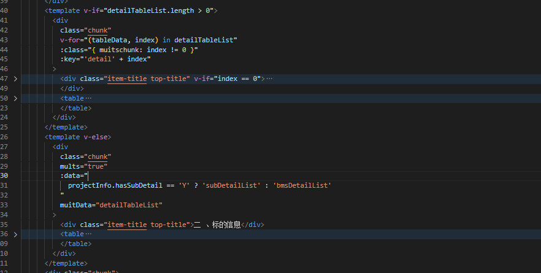

```
layout: post
title: 打印与导出,预览PDF
date: 2023-06-12
Author: 念书
keyword: js,css,html
excerpt: print,export,预览PDF
categories: 
tags: [JavaScript]
comments: true
```

### 打印

打印控件有很多,但是自从flash相关的插件被淘汰,window.print()便成为了唯一的方案,即便是一些可以局部打印的控件,一般也是通过iframe以window.print()来实现的. 基本思路是把dom添加到iframe中,然后调用iframe的print(). 当然也可以指定一些样式. 

打印一般除了绘制基础的页面以外一般还要设置一些打印相关的样式,比如去掉页眉页脚,指定纸张方向, 分页的断点


### 导出

#### 导出PDF

​	导出pdf一般是通过jspdf这个库来实现的,这个库可以创建pdf并且添加文字和图片. 我们可以通过html2Canvas把页面转为图片,然后把图片添加到pdf中.


最初的代码是这样的,这里我是以A4纸的大小来生成PDF.

```javascript
    printOut(el, fileName) {
        var that = this;
        var shareContent = document.querySelector(`#${el}`); //需要截图的包裹的（原生的）DOM 对象
        var width = shareContent.offsetWidth; //获取dom 宽度
        var height = shareContent.offsetHeight; //获取dom 高度
        shareContent.style.height = height + 'px';
        shareContent.style.width = width + 'px';
        var canvas = document.createElement("canvas"); //创建一个canvas节点
        var scale = 2; //定义任意放大倍数 支持小数
        canvas.width = width * scale; //定义canvas 宽度 * 缩放，在此我是把canvas放大了2倍
        canvas.height = height * scale; //定义canvas高度 *缩放
        canvas.getContext("2d").scale(scale, scale); //获取context,设置scale
        html2Canvas(document.querySelector(`#${el}`), {
          scale: 2,
          dpi: 300,
          allowTaint: true,
        }).then(function (canvas) {
          var context = canvas.getContext("2d");
          // 【重要】关闭抗锯齿
          context.mozImageSmoothingEnabled = false;
          context.webkitImageSmoothingEnabled = false;
          context.msImageSmoothingEnabled = false;
          context.imageSmoothingEnabled = false;
          //  document.body.appendChild(canvas);
          var imgData = canvas.toDataURL("image/png", 1.0); //转化成base64格式,可上网了解此格式
          var img = new Image();
          img.src = imgData;
          img.onload = function () {
            img.width = img.width / 2; //因为在上面放大了2倍，生成image之后要/2
            img.height = img.height / 2;
            var pdf = new JsPDF("p", "mm", [297, 210]);
            let position = 0;
            const imgProps = pdf.getImageProperties(imgData);
            const pdfWidth = pdf.internal.pageSize.getWidth();
            const pdfHeight = pdf.internal.pageSize.getHeight();

            const imageWidth = imgProps.width;
            const imageHeight = Math.floor(NP.times(NP.divide(pdfWidth, imgProps.width), imgProps.height));

            let height = 0;
            if (imageHeight < pdfHeight) {
              pdf.addImage(imgData, "jpeg", 0, position, pdfWidth, imageHeight);
            } else {
              while (height < imageHeight) {
                pdf.addImage(
                  imgData,
                  "jpeg",
                  0,
                  position,
                  pdfWidth,
                  imageHeight
                );
                position = position - pdfHeight;
                height += pdfHeight;
                if (height < imageHeight) pdf.addPage();
              }
            }

            pdf.save(fileName + ".pdf");

          };
        });
    },
```

尽管这里边有部分代码是冗余的,但是当我们传入相应的dom节点和文件名称,还是可以生成对应的pdf的.


然后遇到了第一个问题,分页

上边的js尽管可以进行分页,但是是一种阶段性的分页,会把内容切割,效果很不好. 那我的想法是把功能按照业务分块,当当前页面不能放开两个内容块时,通过margin-bottom提前空出内容来辅助分页

```javascript
    async resizeHeight(dom) {
      let a4 = document.getElementById('a4').getBoundingClientRect();//A4纸大小的盒子作为分页的参考
      const a4Width = a4.width
      const a4Height = Math.floor(a4.height)
      let pageHeight = a4Height //纸张剩余的高度,初始时赋值为A4纸的高度
      let chunks = $('#' + dom).find('.chunk'); //每个业务块作为一个chunk
      chunks.css('margin-bottom', '0px')
      let chunk = null
      for (let i = 0; i < chunks.length; i++) {
        // $.each(chunks,(index,element)=>{
        let element = chunks.eq(i)
        let height = $(element)[0].getBoundingClientRect().height
        let muit = $(element).attr('mults')
        let merge = $(element).attr('merge')

        console.log(muit, '----muit')
        if (muit) {
          if (merge) {
            await this.sigleToMultiMerge(element, a4Height, dom, pageHeight)
            return
          } else {
            await this.sigleToMulti(element, a4Height, dom, pageHeight)
            return
          }
        }
        chunk = $(element)
        if (pageHeight == a4Height) {
          //新的一张A4纸
          let surplusHeight = height % a4Height
          pageHeight = NP.minus(pageHeight, surplusHeight)
        } else {
          //已经有内容的A4纸
          if (height > pageHeight) {
            //装不下新的内容
            chunk.prev().css('margin-bottom', pageHeight + 'px')
            pageHeight = a4Height //另起一行
            let surplusHeight = height % a4Height
            pageHeight = NP.minus(pageHeight, surplusHeight)
          } else {
            pageHeight = NP.minus(pageHeight, height)
          }
        }
      }
      // })
      if (pageHeight) {
        let chunk = chunks.last()
        chunk.css('margin-bottom', pageHeight + 'px')
      }
    },
```

上边的代码有用到sigleToMultiMerge,sigleToMulti两个方法. 这两个方法是处理一张A4纸装不下的表格的,sigleToMultiMerge代表表格中有合并单元格. 思路就是当一页装不下之后,通过高度计算把一个表格变成多个表格,即一个二维数组,第一层是页数,第二层是每页的数据,需要转换的表格添加标记,转换完成的没有标记

```javascript
    sigleToMulti(dom, a4height, page, pageHeight) {
      return new Promise((resolve, reject) => {
        let data = $(dom).attr('data')
        let muitdata = $(dom).attr('muitdata')
        let height = $(dom)[0].getBoundingClientRect().height
        if (height < pageHeight) {//不需要拆分
          this[muitdata] = [this[data]]
          this.$nextTick(() => {
            this.resizeHeight(page).then(() => {
              resolve()
            })
          })
          return
        } else {
          const titleHeight =
            $(dom)
              .find('.top-title')
              .height() || 0
          const theadHeight =
            $(dom)
              .find('.table-head')
              .height() || 0
          let tableArr = []
          let rowArr = []
          let rows = $(dom).find('tr:not(.table-head)')
          for (let i = 0; i < rows.length; i++) {
            let row = rows.eq(i)
            if (i == 0) {
              pageHeight = NP.minus(pageHeight, titleHeight, theadHeight, 12);//减去表头以及标题的高度
            }

            this[data][i].index = i + 1
            let rowHeight = row.height()
            if (rowHeight > pageHeight) {
              tableArr.push(rowArr)
              rowArr = [this[data][i]]
              pageHeight = a4height
              pageHeight = NP.minus(pageHeight, theadHeight, rowHeight, 20)
            } else {
              rowArr.push(this[data][i])
              pageHeight = NP.minus(pageHeight, rowHeight)
            }
          }
          if (rowArr.length > 0) {
            tableArr.push(rowArr)
          }

          this[muitdata] = tableArr
          this.$nextTick(() => {
            this.resizeHeight(page).then((res) => {
              resolve()
            })
          })
        }
      })
    },
        
```

页面结构大概这个样子




```javascript
    sigleToMultiMerge(dom, a4height, page, pageHeight) {
      return new Promise((resolve, reject) => {
        let data = $(dom).attr('data')
        let muitdata = $(dom).attr('muitdata')
        let height = $(dom)[0].getBoundingClientRect().height
        if (height < pageHeight) {
          this[muitdata] = [this[data]]
          this.$nextTick(() => {
            this.resizeHeight(page).then(() => {
              resolve()
            })
          })
          return
        } else {
          const titleHeight =
            $(dom)
              .find('.top-title')
              .height() || 0
          const theadHeight =
            $(dom)
              .find('.table-head')
              .height() || 0
          let tableArr = []
          let rowArr = []
          let rows = $(dom).find('tr:not(.table-head)')
          let prevNode = null
          let rowspan = 0
          let nowRows = 0
          for (let i = 0; i < rows.length; i++) {
            let maxHeight = 0
            let row = rows.eq(i)
            let rowData = this[data][i]
            if (i == 0) {
              pageHeight = NP.minus(pageHeight, titleHeight, theadHeight, 32)
            }

            let rowHeight = row.height()

            if (!isNaN(rowData.rowspan)) { //如果有rowspan说明试一次合并单元格的开始,上一个结束了
              maxHeight = this.getMaxHeight(row);  //合并单元格后的行只有第一行是有所有列的,此时取的最大值,这里还是有一定问题的,因为这里最好还是只取合并的列的高度,此时没做区分
              prevNode = rowData
              rowspan = rowData.rowspan
              nowRows = rowspan
            }


            if (rowHeight > pageHeight || maxHeight > pageHeight) { //如果大于页面剩余高度不做拆分直接换页
              prevNode.rowspan = rowspan - nowRows //拆分后的rowspan 刚开始nowRows是0
              tableArr.push(rowArr)
              rowData.rowspan = nowRows

              rowArr = [{ ...prevNode, ...this[data][i] }]
              nowRows--
              pageHeight = a4height

              pageHeight = NP.minus(pageHeight, theadHeight, rowHeight, 20)
            } else { //如果小于页面剩余高度,拆分
              nowRows--
              rowArr.push(this[data][i])
              pageHeight = NP.minus(pageHeight, rowHeight)
            }
          }
          if (rowArr.length > 0) {
            tableArr.push(rowArr)
          }
          this[muitdata] = tableArr
          this.$nextTick(() => {
            this.resizeHeight(page).then((res) => {
              resolve()
            })
          })
        }
      })
    },

    getMaxHeight(row) {
      let normalTds = $('#demo').find('td[rowspan]'); //这里可以区分一下取合并列高度
      normalTds.html()
      let tds = row.find('td')
      for (let i = 0; i < tds.length; i++) {
        let norml = normalTds.eq(i)
        let td = tds.eq(i)
        norml.css('width', td.width() + 'px').html(td.html())
      }
      let heightArr = []
      for (let i = 0; i < tds.length; i++) {
        heightArr.push(normalTds.eq(i).height())
      }
      return Math.max.apply(null, heightArr)
    },
```


到此模块拆分了,也分页了,表格也不会截断了.


过了一段时间客户反馈下载不下来,拿过数据一看,页面高度超过30000px,html2Canvas罢工了,最简单的方案就是把纸张宽度增加,然后调整一下宽度,html2Canvas确实可以了,但是jspdf有报错了,超过了数组上限,得,只能拆图片了. 好在可以在之前代码的基础上拆解. 


```javascript
    printOutMuiltImage(el, fileName) {
      return new Promise((resolve, reject) => {
        var pdf = new JsPDF("p", "mm", [297, 210]);
        const pdfWidth = pdf.internal.pageSize.getWidth();
        const pdfHeight = pdf.internal.pageSize.getHeight();
        let chunks = $(`#${el}`).find('.chunk');
        let promiseArr = [];

        for (let i = 0; i < chunks.length; i++) {
          console.log("margin", chunks.eq(i).css("margin-bottom"))
          promiseArr.push(this.dom2Canvas(chunks[i]))
        }
        Promise.all(promiseArr).then(datas => {
          //  console.log(datas, "所有数据")
          datas.map((n, index) => {
            this.addPdfPage(pdf, n, pdfHeight, pdfWidth, index);
            let margin = chunks.eq(index).css("margin-bottom")
            if (index < datas.length - 1 && margin !== '0px') {
              this.position = 0;
              pdf.addPage();
            }
          })
          resolve(pdf);
        })
      });
    },

    dom2Canvas(shareContent) {
      return new Promise((resolve, reject) => {

        var width = shareContent.offsetWidth; //获取dom 宽度
        var height = shareContent.offsetHeight; //获取dom 高度
        var canvas = document.createElement("canvas"); //创建一个canvas节点
        var scale = 2; //定义任意放大倍数 支持小数
        canvas.width = width * scale; //定义canvas 宽度 * 缩放，在此我是把canvas放大了2倍
        canvas.height = height * scale; //定义canvas高度 *缩放
        canvas.getContext("2d").scale(scale, scale); //获取context,设置scale
        html2Canvas(shareContent, {
          scale: 2,
          dpi: 300,
          allowTaint: true,
        }).then(function (canvas) {
          var context = canvas.getContext("2d");
          // 【重要】关闭抗锯齿
          context.mozImageSmoothingEnabled = false;
          context.webkitImageSmoothingEnabled = false;
          context.msImageSmoothingEnabled = false;
          context.imageSmoothingEnabled = false;
          // document.body.appendChild(canvas);
          var imgData = canvas.toDataURL("image/png", 1.0); //转化成base64格式,可上网了解此格式
          resolve(imgData)
        })
      })

    },
    addPdfPage(pdf, imgData, pdfHeight, pdfWidth, index) {

      const imgProps = pdf.getImageProperties(imgData);


      const imageWidth = imgProps.width;
      const imageHeight = Math.floor(NP.times(NP.divide(pdfWidth, imgProps.width), imgProps.height));
      // console.log(imageHeight, "图片高度")

      // let position = 0
      let height = 0;
      if (imageHeight < pdfHeight) {
        pdf.addImage(imgData, "jpeg", 0, this.position, pdfWidth, imageHeight);
        this.position = this.position + imageHeight;
      } else {
        while (height < imageHeight) {
          pdf.addImage(
            imgData,
            "jpeg",
            0,
            this.position,
            pdfWidth,
            imageHeight
          );
          this.position = this.position - pdfHeight;
          height += pdfHeight;
          if (height < imageHeight) pdf.addPage();
        }
      }

    },
        
        
  //这里需要注意两点,一是宽高的计算
      //const imageWidth = imgProps.width;
     // const imageHeight = Math.floor(NP.times(NP.divide(pdfWidth, imgProps.width), imgProps.height));
      //  一定要通过比例计算出相对于PDF的宽高,毕竟元素的宽高是像素,PDF当前的宽高是mm. 这里做不好会失真的
        
//另一点是    pdf.addImage(imgData, "jpeg", 0, this.position, pdfWidth, imageHeight);
   //     这里的this.position很关键,它是图片的便宜. 当我们一张图片大于一页pdf时,我们要把图片的剩余部分添加到第二页pdf上.这时候我们pdf.addPage();添加一页pdf然后this.position - pdfHeight;把图片上移一页pdf的高度
      //  当我们一页pdf需要放多张图片时,我们把第二张图片下移第一张图片的高度 this.position = this.position + imageHeight;
```

这里把pdf对象返回了,这是因为要把生成的文件添加到压缩包

```
          this.printOutMuiltImage(dom).then((pdf) => {
            zip.file(`${name}.pdf`, pdf.output('blob'))
            resolve()
          })
```


### PDF预览

本来预览是直接下载pdfjs的文件,然后把流或者路径通过url传过去就行了,但是前后端分离的项目这样就不优雅了,于是采用pdfjs-dist写了个组件,需要注意这个插件不同版本的写法是不兼容的,这是"pdfjs-dist": "2.4.456", 如果是签名预览时默认不显示需要改一下源码

```
// if (data.fieldType === "Sig") { //注释掉这三行代码
//   data.fieldValue = null;
//   this.setFlags(_util.AnnotationFlag.HIDDEN);
// }
```


 ```
 <template>
   <div class="base-pdf-box">
     <div class="canvas-container" ref="canvas" :id="domId">
       <canvas
         v-for="page in pages"
         :id="domId + 'the-canvas' + page"
         class="page"
         :key="page"
       >
       </canvas>
     </div>
     <div
       :style="{
         height: '1px',
         'margin-top': '-1px',
         overflow: 'hidden',
         width: width,
         position: 'relative'
       }"
       class="a4-box"
     >
       <div
         :id="A4DomId"
         :style="{
           position: 'absolute',
           width: width,
           height: height,
           'z-index': 1
         }"
       ></div>
     </div>
     <el-button
       size="small"
       ref="base-print"
       v-show="false"
       type="primary"
       v-print="printObj"
       >打印</el-button
     >
   </div>
 </template>
 
 <script>
 import PDFJS from 'pdfjs-dist'
 import axios from 'axios'
 import workerSrc from 'pdfjs-dist/build/pdf.worker.entry'
 PDFJS.workerSrc = workerSrc
 export default {
   name: 'base-pdf',
   data() {
     return {
       pages: [],
       pdfDoc: {},
       pages: 0,
       iframeUrls: '',
       printObj: {
         id: 'pdf',
         popTitle: '',
         extraCss: '',
         extraHead: '<meta http-equiv="Content-Language"content="zh-cn"/>',
         beforeOpenCallback(vue) {
           // vue.printLoading = true
           console.log('打开之前')
         },
         openCallback(vue) {
           // vue.printLoading = false
           console.log('执行了打印')
         },
         closeCallback(vue) {
           console.log('关闭了打印工具')
         }
       }
     }
   },
   props: {
     fileId: {
       type: String,
       default: '402881c388320a08018832cafa0700b7'
     },
     domId: {
       type: String,
       default: 'pdf'
     },
     A4DomId: {
       type: String,
       default: 'A4'
     },
     width: {
       type: String,
       default: '210mm'
     },
     height: {
       type: String,
       default: '297mm'
     }
   },
   watch: {
     fileId() {
       this.getData().then(() => {
         this._loadFile(this.iframeUrls)
       })
     }
   },
   mounted() {
     this.printObj.id = this.domId
     this.getData().then(() => {
       this._loadFile(this.iframeUrls)
     })
   },
   methods: {
     _renderPage(num) {
       this.pdfDoc.getPage(num).then((page) => {
         let A4Page = document.getElementById(this.A4DomId)
         let canvas = document.getElementById(this.domId + 'the-canvas' + num)
         console.log(canvas, this.A4DomId + 'the-canvas' + num, '--------------')
         var vp = page.getViewport({ scale: 1 })
         debugger
         let ctx = canvas.getContext('2d')
         let dpr = window.devicePixelRatio || 1
         let bsr =
           ctx.webkitBackingStorePixelRatio ||
           ctx.mozBackingStorePixelRatio ||
           ctx.msBackingStorePixelRatio ||
           ctx.oBackingStorePixelRatio ||
           ctx.backingStorePixelRatio ||
           1
         let ratio = dpr / bsr
         let viewport = page.getViewport({
           scale: A4Page.offsetWidth / vp.width
         })
         canvas.width = viewport.width * ratio
         canvas.height = viewport.height * ratio
         canvas.style.width = viewport.width + 'px'
         ctx.setTransform(ratio, 0, 0, ratio, 0, 0)
         let renderContext = {
           canvasContext: ctx,
           viewport: viewport
         }
         page.render(renderContext)
         if (this.pages > num) {
           this._renderPage(num + 1)
         }
       })
     },
     _loadFile(url) {
       // this.$showLoading()
       console.log(PDFJS)
       PDFJS.getDocument(url).promise.then((pdf) => {
         console.log(pdf)
         // this.$closeLoading()
         this.pdfDoc = pdf
         this.pages = this.pdfDoc.numPages
         this.$nextTick(() => {
           this._renderPage(1)
         })
       })
     },
     print() {
       this.$refs['base-print'].$el.click()
     },
     download() {
       // this.$refs..scroll({ top: 0 })
       window.open(`baseAttachmentController.do?downloadFile&id=${this.fileId}`)
     },
     getData() {
       return new Promise((resolve, reject) => {
         axios({
           method: 'GET',
           url: `baseAttachmentController.do?downloadFile&id=${this.fileId}`, //后端给的接口402881c388320a08018832cafa0700b7
           responseType: 'blob' // 更改responseType类型为 blob
         }).then((res) => {
           const blob = new Blob([res.data], { type: 'application/pdf' })
           this.iframeUrls = window.URL.createObjectURL(blob)
           resolve()
         })
       })
     }
   }
 }
 </script>
 <style lang="scss" scoped>
 @page {
   size: auto A4 portrait;
   margin: 0;
 }
 @media print {
   .a4-box {
     display: none;
   }
 }
 #pdf {
   position: relative;
 }
 #A4 {
   visibility: hidden;
 }
 .base-pdf-box {
   width: 100%;
   height: 100%;
 }
 .canvas-container {
   display: flex;
   flex-direction: column;
   margin: auto;
   overflow: hidden;
   align-items: center;
   font-size: 0;
 }
 </style>
 
 ```

### 图片预览

```
<template>
  <el-dialog
    :title="fileName"
    :visible.sync="dialogVisible"
    width="500px"
    @open="setSrc"
    @close="close"
    append-to-body
  >
    <el-image :src="imageUrl" fit="scale-down">
      <div slot="error" class="image-slot">
        <i class="el-icon-picture-outline"></i>
      </div>
    </el-image>
    <span slot="footer" class="dialog-footer">
      <el-button @click="close">关 闭</el-button>
    </span>
  </el-dialog>
</template>

<script>
// import { reactive, toRefs } from 'vue'
export default {
  name: 'view-image',
  data() {
    return {
      dialogVisible: false,
      imageUrl: ''
    }
  },

  props: {
    fileId: {
      type: String,
      default: ''
    },
    fileName: {
      type: String,
      default: ''
    },
    visible: {
      type: Boolean,
      default: false
    },
    imageData: {
      type: Blob
    }
  },
  watch: {
    visible() {
      this.dialogVisible = this.visible
    }
  },
  methods: {
    close() {
      URL.revokeObjectURL(this.imgageUrl)
      this.$emit('update:visible', false)
    },
    downFile(url, parameter, method = 'get') {
  if (method == 'get') {
    return axios({
      url: url,
      params: parameter,
      method: method,
      responseType: 'blob'
    })
  } else {
    return axios({
      url: url,
      method: method,
      data: parameter,
      responseType: 'blob'
    })
  }
},
    setSrc() {
      console.log(this.imageData)
      this.imageUrl = URL.createObjectURL(
        new Blob([this.imageData], { type: 'application/json' })
      )
    }
  },
  created() {
    downFile(this.url, { id: this.fileId }).then((res) => {
        console.log('blob', res)
        this.imageData = res
      })
  }
}
</script>

<style lang="scss" scoped></style>

```


